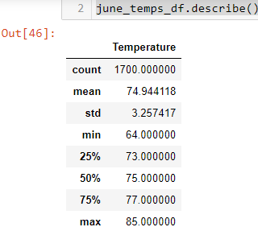
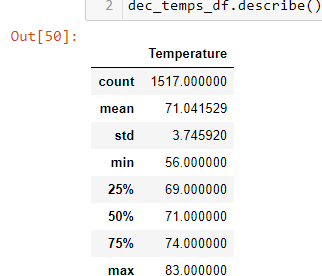

# Module 9 Challenge

## Overview
* An analysis of the difference between the temperature in June and December is conducted to better understand if the weather on Oahu is conducive to run a surf and ice cream shop all year round

## Results
* For subsequent points, see the following summary tables:  and 
* On average, June is a slightly hotter month than December, with an average temperature of 75degrees (supposedly Fahrenheit), compared to 71degrees in December. The greater temperature in June versus December can be seen across the minimum, median, 1st and 3rd quartile, as well as maximum temperatures for each month 
* Furthermore, the temperatures in June are distributed a little more closely around its mean temperature of 75degrees (less variance) than the temperatures in December. In fact, the minimum temperature in December is 56degress, 15degrees lower than the mean in December, compared to the 11degree difference between the minimum in June (64 degrees) and its mean

## Further Recommended Analysis 
This information suggests that December is colder than June, and this might negatively impact sales of ice cream and surfing in December. To offset potential losses in December, I would investigate the following:
* The impact of a drop in temperature on the sales of surfing services and ice cream
* I would also investigate the nature of precipitation in June vs December to see if surfing and ice cream consumption could be affected by these as well